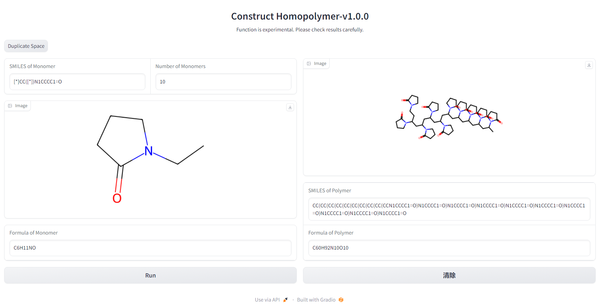

## Construct Homopolymer-v1.0.0

- A tool for creating homopolymers by SMILES of monomers based on [psmiles](https://github.com/Ramprasad-Group/psmiles)

### Installation

```
git clone https://github.com/eastsheng/construct_homopolymer.git
pip install -r requirements.txt
```

### Run

```
python app.py
```



### Notes

- Function is experimental. Please check results carefully.
- SMILES of Monomer should first be modified to the form `[*]xxx([*])xxx`, where `[*] `represents the node to be connected, also, double bonds between connections should be carefully considered as single bonds.